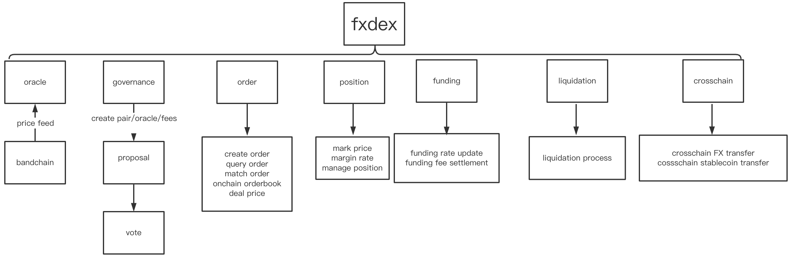
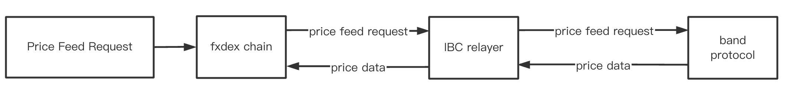
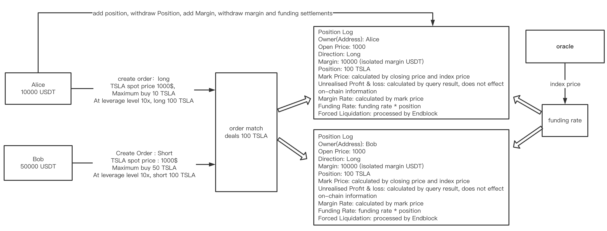
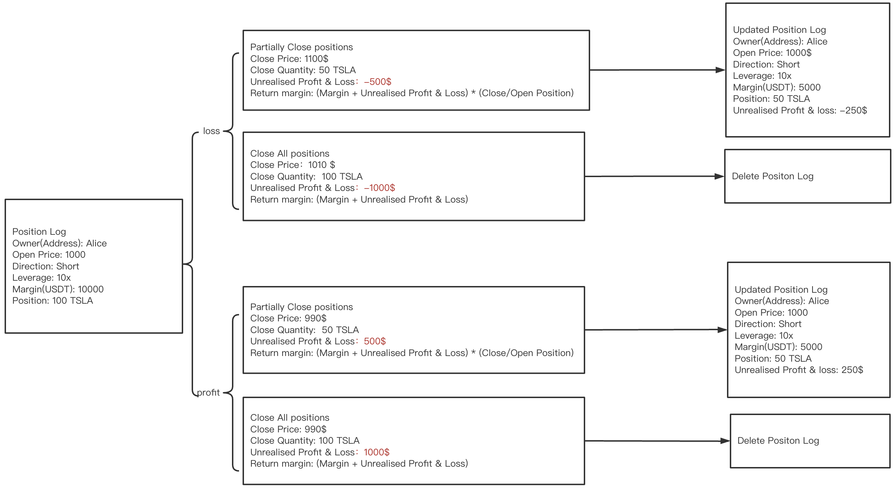
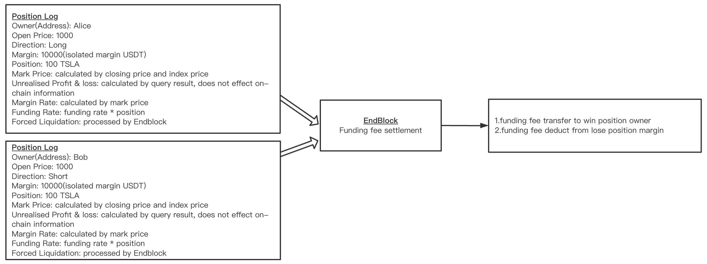
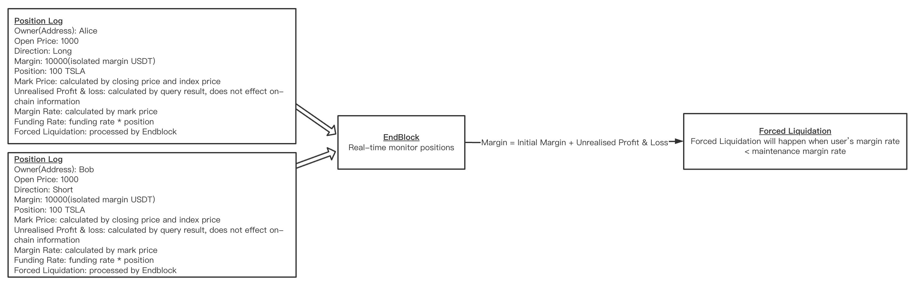

# Perpetual DEX Technical Paper


DEX Modules



## 1.DEX Chain
Dex Chain implements decentralized perpetual protocal:
- Supports USDT/USDC/Dai 3 types of stable coin mrgin trades, supports Ethereum - DEX cross chain transaction
- Supports on-chain orderbook
- Supports decentralized oracle price feed by Endblock. Funding settlements will be made according to funding rate
- Supports position monitoring, forced liquidation
- Supports call auction aggregated trades

## 2.Price Feed
DEX chain retrieves price information from Band Protocol via IBC Replayer as perpetuals' index price. DEX chain allows validators to send price feed requests to the oracle. When a request is received, the DEX chain will post an request to band protocol on all open trade pairs via IBC Replayer



### 2.1 **Data Source**

**1) Cryptocurrency**
+ CCXT
+ CRYPTOCOMPARE
+ COINMARKETCAP
+ COINGECKO
+ COINBASEPRO
+ BRAVENEWCOIN

**2) Stock**: currently use itiger stock market(TIGR in NASDAQ) and IEXCLOUD

### 2.2 **Price Data Source Supported Trade Pair**
**1) Crypto**: such as BTC, ETH, LTC, BNB  etc.

**2) Stock**: almost all NYSE and NASDAQ stocks

### 2.3 **Index Price**
The index price of a trade pair is the median of mulitiple prices obtained from different data sources, including pre/during/post stock markets

### 2.4 **Price Update Frequency**
Price update frequency is two times IBC cross-chain times needed, usually takes 15s, depending on Dex chain and Band Protocol chain block time.

## 3.Governance Module (Disabled for Alpha Test)

Governmence Module includes 4 stages: **Deposit stage, Voting stage, Counting stage and Deploying stage**

**1) Deposit stage**

A minimum deposit of 10000 FX Token within two hours is required to initiate a proposal. Any FX Token holder can support a proposal by depositing the token.

**2) Voting Stage**

Validator will cast the vote on behalf of the delegators that delegated their vote ($FX) to that validator. Currently options: "Approve", "Decline", "Veto" and "Abstain". The voting period lasts two hours.

**3) Counting Stage**

A proposal shall be approved only if requirements below are fulfilled:

1. Quorum: Over 40% voting pover participated;
2. Threshold: Over 50% participated votting power approved the proposal;
3. Veto: Less than 33.4% participated voting power veto the proposal.

**4) Deploying Stage**

A proposal will be deployed once it's approved.

### 3.2 Trade Pair

#### 3.2.1 Create By Governance Voting

Using Governance Voting to initiate a proposal. After the proposal is approved, new trade pairs will take effect.

#### 3.2.2 Trade Pair Information

Each trade pair includes information below:

- pair id
- base asset denominator
- quote asset denominator
- price precision
- position precision
- max leverage
- maintenance margin rate

Authorized oracle is able to feed prices to multiple trade pairs.

**Leverage(1-125x)**: max supported leverage level is 125, max trading supported leverage is 25

| Tier|  	Position Bracket(Notional Value in USDT)	| 		Max Leverage 	| Maintenance Margin Rate			| 	Maintenance Amount (USDT)	| initial margin rate|
| ---------------- | ------------------ | -------------------- | ---- | ---- | ----|
|1|		0 - 50,000	|				125x|			0.40%		|	0				|			0.008|
|2|		50,000 - 250,000|			100x|			0.50%		|	50				|			0.001|
|3|		250,000 - 1,000,000|			50x	|			1.00%	|		1,300		|				0.02|
|4|		1,000,000 - 7,500,000|		20x	|			2.50%		|	16,300			|			0.05|
|5|		7,500,000 - 40,000,000|		10x	|			5.00%		|	203,800			|			0.1|
|6|		40,000,000 - 100,000,000|	5x	|			10.00%		|	2,203,800		|			0.2|
|7|		100,000,000 - 200,000,000|	4x	|			12.50%		|	4,703,800		|			0.25|
|8|		200,000,000 - 400,000,000|	3x	|			15.00%		|	9,703,800		|			0.33|
|9|		400,000,000 - 600,000,000|	2x	|			25.00%		|	49,703,800		|			0.5|
|10|		600,000,000 - 1,000,000,000|	1x	|			50.00%	|		199,703,800	|				1|

## 4.Orders and Positions

### 4.1 Open Position(Long/Short)

Fxdex uses isolated margin mode,the margin placed into a position is isolated from the trader's account balance.
Supports two direction positions.

In USD-Marginated Futures, the collateral is USDT, the base quantitiy of the quote asset is recorded.

**Example: BTC/USDT Perpetuals**

Spot price of BTC is 50000$. Alice has 10000 USDT, max buy 0.2 BTC spot, leverage level 10x, long 2 BTC

Bob has 50000 USDT, max buy 1 BTC spot, leverage level 10x, short 1 BTC

The market fills an order of 1 BTC at 50000$



### 4.2 Aggregate Trading

On chain, orders are discretly created by block. Dex uses Call Auction to aggregate orders periodically.

Call Auction method made sure that there is only one execution price in one block. Orders will be sorted and filled according to price and time to prevent miners benefiting from advanced trade. Also this lessens the effect of aggregated order queue.

- Collect orders in this block, update depth book, compute execution price and max execution
- If Max Execution >0, orders will be sorted
- Sort orders by price, block height and sequence
- Fill buy orders and sell orders with Max Execution
- If Max Execution <0, orders will queue.

Execution Price Selection Algorithm:

- **Rule0:** if best bid < best ask, no matching orders, no orders are filled
- **Rule1:** max order quantity principle, when orders are filled at benchmark price, the maximum available order quantity can be obtained. If there are several levels of prices fulfilling the max quantity order principle, proceed to the next step
- **Rule2:** minimum excessive order quantity principle, excessive order quantity is the difference between the accumulated bid orders and the accumulated ask orders. Minimum excessive order quantity principle means that the benchmark price should satisfies 2 conditions, a) the benchmark price should comply with Rule 1, b) the benchmark price level should have the minimum excessive order quantity in absolute magnitude.
- **Rule3:** Bmarket pressure principle, in the case of several price levels fulfilling Rule 1 and Rule 2 (among these price levels, we identify the max price and the min price), the potential market pressure should be identified. When the excessive order quantities at all price levels are positive, there are more bid orders than ask orders. The market is in buyer pressure. When the excessive order quantities at all price levels are negative, there are more ask orders than bid orders -- the market is in seller pressure. If excessive order quantities have both positive and negative signs, there is no clear market pressure. Depending on the potential market pressure level, the following rules are to be considered to identify a reference price (ref). Once, the ref is identified, if the ref is in the range of [min price, max price] the ref will be taken as the benchmark price; if the ref is outside in the range of [min price, max price], the benchmark price is min price or max price whichever is closer to the ref price.
- **Rule3a:** if excessive order quantities at all price levels are positive, the market is in buyer pressure, the ref price is 95% of the last price.
- **Rule3b:** if excessive order quantities at all price levels are negative, the market is in seller pressure, the ref price is 105% of the last price.
- **Rule3c:** if excessive order quantities at all price levels have both positive and negative signs, no clear market pressure, the ref price is the last price.


### 4.3 Orders

Users are able to creat limit orders, orders will queue in the orderbook. Users are able to cancel unfilled orders

The amount of unfilled orders are restricted to 10000 per account per trade pair

## 5 Positions

**Position Information**

- position size(base asset)
- margin(quote asset)
- Direction(long/short)
- leverage
- entry price
- liquidation price
- margin rate
- unrealized Profit & Loss

**Add Margin**: add margin/margin rate

**Reduce Margin**: Currently not supported

**Close Position**: Close position by orders



## 6.Funding Rate

Funding rates are periodic payments either to traders that are long or short based on the difference between perpetual future prices and spot prices. When the funding rate is positive, Long pays Short. When the funding rate is negative, Short Pays Long.

Precise feed price is needed upon payments, then settle between Longs and Shorts.

### 6.1 Funding Times

Time is Eastern Standard Time (EST, UTC-5)
- Standard Summer Time: 03:05, 08:35, 15:05, 19:05
- Standard Winter Time: 04:05, 09:35, 16:05, 20:05
- No Funding Rate on weekends, holidays
- Four times during trading day

### 6.2 Calculation

Funding rates are calculated using the following formula:

```
Impact Bid Price = The average fill price to execute the Impact Notional on the Bid side
Impact Ask Price = The average fill price to execute the Impact Notional on the Ask side

The Impact Margin Notional (IMN) for USDT-Margined Contracts is the notional available to trade with 200 USDT worth of margin (price quote in USDT), IMN is used to locate the average Impact Bid or Ask price in the order book.

The maximum leverage FxDex perpetual contract is 25x, and its corresponding Initial Margin Rate is 4%, then the Impact Margin Notional (IMN) is 5000 USD, and the chain will take an IMN of 5000 USD every minute in the order book to measure the average Impact Bid/Ask price.

Intrest Rate (I) = 1%
Mark Price = Avg Oracle Price

Premium Index (P) = (Max(0, Impact Bid Price - Mark Price) - Max(0, Mark Price - Impact Ask Price)) / Spot Price 

Avg Premium Index is the Time Weighted Average Premium Index, FxDex will calculate and record AvgP every minute.
 AvgP = (1 * P_1 + 2 * P_2 + 3 * P_3 +...+ 480 * P_480) / (1 + 2 + 3 +···+ 480)

Funding Rate = Avg Premium Index+ clamp (Interest Rate - Avg Premium Index , 0.05%, -0.05)

clamp() is a bounding function:

clamp(a, max, min):
  if a > max, a = max;
  if a < min, a = min;
  if min < a < max, a = a.

funding rate is equal to interest rate if (interest rate - avg premium index rate) is within +/- 0.05
Funding periods are: 5.5 hrs, 6.5hrs and 8hrs.
```
Since avg premium index and price index are not applicable in pre-market,the Pre-market funding rate is fixed to +/-0.01%. Settlement direction is determined by addresses' positions:
- If Long > Short, long pays short
- If Short > Long, short pays long
- If Long = Short, no settlements will be made

### 6.3 Funding Payments

Funding settlements will be made from begin block, the maximum number of position settlement for each block is 1000. The chain will only do funding settlements during the settlement period. If the funding rate is positive, payments will be made to user account. If the funding rate is negative, funding settlement will be deducted from user's margin account.

## 7. Settle Funding

### 7.1 Insurance Fund

Centralized Exchanges provides insurance clearance reserves to users. When a user's position is liquidated, the insurance fund will take over the liquidations and offload positions. The Insurance clearance reserves serves as liquidity at liquidation price. If the insurance funds are insufficient, counterparty liquidation happens.

Perpetual Dex insurance funds are part of collateral and transaction fees.




### 7.2 Liquidation

When margin rate falls under maintenance margin rate, user's position will be liquidated. All open orders are immediately canceled, the remaining positions and transaction fees will be assigned to the insurance clearance reserves.



## 8 Cross-Chain Stable Coin Transaction

- Accept FxCore - Etherum transaction via cross-chain bridge
- Accept FxDex - FxCore transaction via IBC Replayer
- USDT/USDC/Dai/FX -> FxCore -> Dex

## 9 Conclusion
As a decentralized exchange, DEX chain is restricted by 1s block time. Orders are restricted by mempool (regardless of order type). The maximum number of orders can be processed is 2000. After mempool is full, the node will stop receving new order requests until fully processed current orders, otherwise it will affect block time.

On DEX chain, the total amount of orders is not restricted. Meantime each block is set to process 1000 orders. By aggregating, orders will be sort by: 1. price, 2. order created time. When the number of executable orders exceeds 1000, exceeded orders will be processed by next block. During this time, current trade pair and new orders will be locked until current orders are processed. Other types of orders are not restricted.

